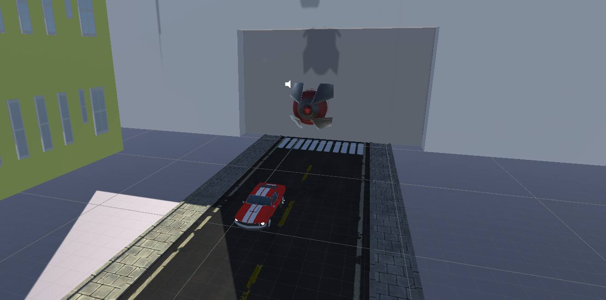
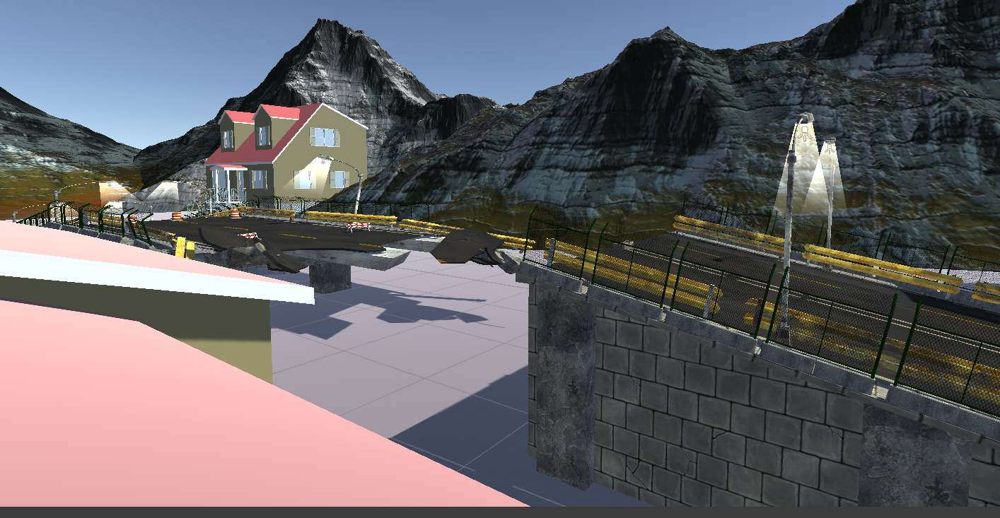

# Unity-Atividade

Duplas: Denis Rocha e Gabriel Toledo
link do arquivo e do video: https://drive.google.com/drive/folders/1a0byPmlWgPUqkUNs0nlAoaPcsSLR2Br3?usp=sharing

Read.me (unity):

Nesse projeto o jogo é feito a partir de pistas, prédios, casas e alguns outros obstáculos.
Se passa em um cenário urbano, cercado por montanhas.

O código foi feito para que o objeto nave siga o objeto carro, enquanto o carro é perseguido, a música "Tokyo drift" toca.

Nos scripts utilizamos colisão, física e target.

